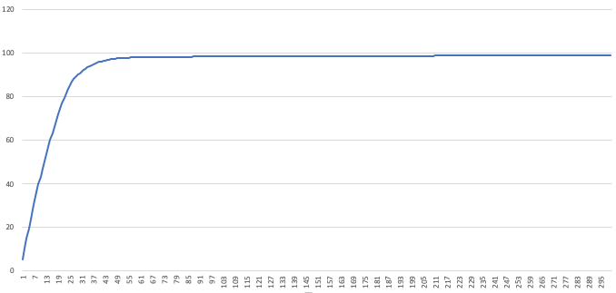

Got junk sequences in your sequencing FASTQs? 

Many experiments are riddled with repetitive sequences which are of no
value to the scientific question you are asking. Some examples include
ribosomal RNA and hemoglobin. DASH ([1](#dash)) is a CRISPR-Cas9
next-generation sequencing (NGS) technology which depletes abundant
sequences, increasing coverage of your sequences of interest. :scissors:

In the lab, you take final NGS libraries ready for sequencing, and
combine them with pre-programmed Cas9 guide RNAs (gRNAs) which cut up
your repetitive sequences into small fragments. You then size select
and amplify your remaining DNA, which should contain most or only your
sequences of interest. 

`DASHit` ([2](#dashit)) is the software that designs Cas9-gRNAs to target your particular experiment.

For more details on the wet lab side, [check out our actual protocol.](https://dx.doi.org/10.17504/protocols.io.6rjhd4n)([3](#dash-protocol))

1. <a name="dash"></a> Gu, W. et al. [Depletion of Abundant Sequences by Hybridization (DASH): using Cas9 to remove unwanted high-abundance species in sequencing libraries and molecular counting applications.](https://genomebiology.biomedcentral.com/articles/10.1186/s13059-016-0904-5) Genome Biology 17, 41 (2016).
2. <a name="dashit"></a> Dynerman, D and Lyden, A. et al. `Preprint soon!`
3. <a name="dash-protocol"></a> Lyden, A. et al. [DASH Protocol V.4](https://https://dx.doi.org/10.17504/protocols.io.6rjhd4n).

# Installing 

Please visit the [GitHub repository](https://www.github.com/czbiohub/dashit) for instructions on how to install `DASHit`.

# The Idea
In order for DASH to be maximally effective, we want to pick the fewest guides which hit the largest possible number of sequences that you want depleted. The best way to find the over-abundant sequences in your data is to look at it!

`DASHit` uses reads from a preliminary, low-depth sequencing of your samples to identify abundant CRISPR-Cas9 cut sites. It has a filtering function for the guides it identifies, which allows you to specify on and off target sequences, and filter based on GC content and secondary structure. It then computes an optimized guide list by producing a set number of guides which hit the largest number of sequences in the preliminary data.

Next, we'll describe the [DASHit pipeline](#dashit-pipeline), or, you can [skip ahead to a real example](#a-real-example).

For even more detail, please see the `DASHit` paper ([2](#dashit)). 

# DASHit Pipeline
`DASHit` is a collection of several tools you can use to design gRNAs that target the sequences you want.

**INPUT:** A FASTQ file `input.fastq` containing the abundant sequences you want to target for depletion.

> **NOTE**: We usually subsample `input.fastq` down to several hundred thousand reads with `seqtk` before proceeding. 

1. Use [seqtk](https://github.com/lh3/seqtk) (or another tool) to convert the input to FASTA format
   ```shell
   seqtk -A input.fastq > input.fasta
   ```
2. Run `crispr_sites -r` to find candidate Cas9-gRNAs in your input.
   ```shell
   cat input.fasta | crispr_sites -r >! input_sites_to_reads.txt
   ```
   :flashlight: Each line of `input_sites_to_reads.txt` contains a 20-mer Cas9 guide RNA found in `input.fasta`, together with a list of reads that 20-mer appeared in
3. *(Optional, but you'll probably want this)* You may want to restrict your gRNAs to a particular *ontarget* region, and also disqualify guides that hit some *offtarget* region.
   1. Obtain FASTA files of your ontarget and offtarget regions
   2. Run `crispr_sites` to find ontarget and offtarget gRNAs
      ```shell
	  cat ontarget.fasta | crispr_sites >! ontarget_sites.txt
      cat offtarget.fasta | crispr_sites >! offtarget_sites.txt
	  ```
      :heavy_exclamation_mark: For the ontarget and offtarget files, run `crispr_sites` **without** the `-r` flag.
3. Filter your candidate guide RNAs, removing those with low-quality structure (GC content, homopolymer, dinucleotide repeats, and hairpins). Optionally remove all guides RNAs present in `offtarget_sites.txt`, and those *not* present in `ontarget_sites.txt`
   ```shell
   dashit_filter --gc_freq_min 5 --gc_freq_max 15 --ontarget ontarget.txt --offtarget offtarget.txt input_sites_to_reads.txt > input_sites_to_reads_filtered.txt
   ```
   :flashlight: Run `dashit_filter --help` for an explanation of the quality filtering and to learn how to change quality thresholds.
   
   :heavy_exclamation_mark: ontarget and offtarget filtering require port 8080 to be available on your computer.
4. Find 300 guides that hit the largest number of reads
   ```shell
   optimize_guides input_sites_to_reads_filtered.txt 300 1 > guides.csv
   ```
   :flashlight: You should experiment with different numbers of guides 
   
   :flashlight: the `number of times to cover each read` option, here set to 1, is how many guides need to hit a read in `input.fasta` before that read is considered covered. In principle you could use this for additional redundancy, but in practice we've never needed anything other than 1
5. Examine `guides.csv` to see how we did. Open this file in Excel and plot the last column. This plot will show the cumulative number of reads hit in `input.fasta` the designed guides hit. You can use this plot to pick the number of guides to use: look for the "elbow" in the plot, and notice where diminishing returns on the number of guides kicks in.
   
   *We see around 50 guides are already covering almost 100% of our `input.fasta`. Ordering 300 guides would be overkill, in this case*
6. Score how well your guides do against `input.fasta` - this should match the plot from `guides.csv`.
   ```shell
   score_guides guides.csv input.fasta
   ```
   :flashlight: `score_guides` is mainly useful to estimate how an existing guide set would perform against a new set of samples. You might not have to design new guides!

**OUTPUT:** `guides.csv`, your DASH guides! 

:flashlight: The [contrib](https://github.com/czbiohub/dashit/tree/master/contrib) directory contains many useful scripts for automating parts of this workflow. For instance, [these scripts](https://github.com/czbiohub/dashit/tree/master/contrib/convert_guide_csv_scripts) will convert your `guides.csv` into a spreadsheet ready to place an order.

# Example
For an example on real data, see [here](https://github.com/czbiohub/croissants/tree/master/2019/dashit_workflow).
